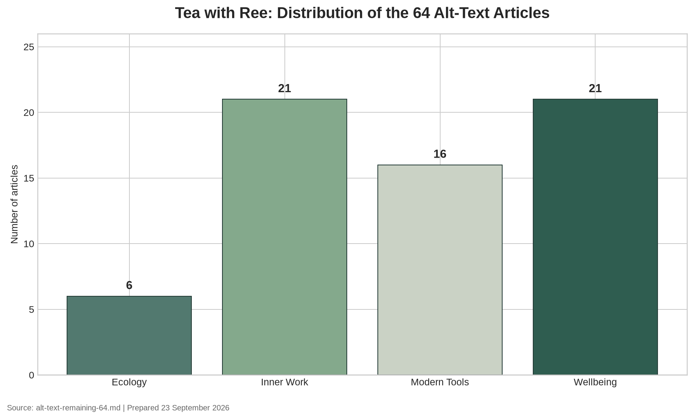

# Tea with Ree Site Audit

**Audit date:** 23 September 2026  
**Repository:** `TeawithRee/TeawithRee.github.io`  
**Live site:** [www.teawithree.com](https://www.teawithree.com/)

## Overall result

The site passes the structural audit. All sitemap URLs and key public assets returned HTTP 200 during the live check. The repository contains no unresolved local links, missing local assets, or SEO warnings after the audit cleanup. The 77 story records in `stories.json` are consistent with their article pages: titles match the page headings, image basenames match the article images, and the approved alt text appears on the corresponding page.

The only code change made during this audit was the addition of complete Twitter card metadata to `about.html`. The homepage’s decorative hero image remains intentionally empty-alt and `aria-hidden`, which is correct for a purely decorative background image.

## Audit results

| Area | Result | Details |
|---|---:|---|
| HTML pages inventoried | Pass | 85 HTML files reviewed; utility fragments and the legacy redirect were treated separately from content pages. |
| Sitemap | Pass | 81 sitemap URLs found and checked live. |
| Live URL status | Pass | 85 live URLs checked, including sitemap pages, `robots.txt`, `sitemap.xml`, `stories.json`, and `style.css`; no non-200 responses. |
| Internal links and assets | Pass | No unresolved repository-relative links or missing local assets. |
| SEO metadata | Pass | Content pages have titles, descriptions, canonical URLs, robots directives, Open Graph title/description, and Twitter title/description. |
| Responsive viewport | Pass | 82 content pages include the responsive viewport declaration. Utility fragments are excluded because they are not standalone documents. |
| CSS responsiveness | Pass | The stylesheet contains 23 media-query blocks. Desktop, tablet, and mobile screenshots showed no visible horizontal overflow or clipped navigation. |
| Typography | Pass | The rendered pages use the intended serif display typography and readable body text at all three checked widths. |
| Article/story consistency | Pass | All 77 selected and library records match their article title, image basename, and approved alt text. |
| Google Analytics | Pass | Measurement ID `G-15387418816` is present on 80 standalone HTML documents. |
| Accessibility | Pass | Lighthouse homepage accessibility score: 100. |
| Best practices | Pass | Lighthouse homepage best-practices score: 100. |
| SEO | Pass | Lighthouse homepage SEO score: 100. |
| Performance | Review recommended | Lighthouse homepage performance score: 84. |

## Lighthouse findings

The homepage scored **84 for performance**, **100 for accessibility**, **100 for best practices**, and **100 for SEO** in Lighthouse 12.8.2. The performance deductions were concentrated in delivery rather than a broken layout or script failure. Lighthouse identified render-blocking CSS, unminified CSS, image sizing and delivery opportunities, cache-lifetime opportunities, and initial document latency.

The most useful future performance work would be to reduce the stylesheet payload, split critical above-the-fold CSS from the rest of the stylesheet, confirm long-lived cache headers for versioned assets, and provide a smaller or more aggressively compressed hero image for the first viewport. These changes were not made automatically because they can affect the site’s visual system and image quality.

## Search-engine readiness

`robots.txt` allows public crawling and declares the XML sitemap at `https://www.teawithree.com/sitemap.xml`. The public sitemap uses the canonical `www` host. This is suitable for Google and Bing crawling; Yahoo search crawling is generally covered through Bing’s crawler ecosystem.

The audit verifies crawl directives, sitemap availability, canonical URLs, metadata, and live response status. It does **not** verify actual index coverage, ranking, or search-console warnings because those require access to the site owner’s Google Search Console and Bing Webmaster Tools accounts. Search-engine indexing can also lag behind a newly published change.

## Social and third-party endpoints

The Google Tag Manager/gtag endpoint returned 200, and the MailerLite universal script returned 200. Instagram and Facebook redirected to login pages, which confirms that the links resolve but does not test authenticated profile visibility. TikTok returned 403 and LinkedIn returned 999 from this audit environment; both are platform anti-bot responses and are not evidence that the profile URLs are broken.

The legacy `ecology-blue-and-blaze-care.html` page returns a 200 response and immediately redirects to the current article URL. The newsletter block and `nav.html` are HTML fragments rather than standalone pages, so they were not evaluated as independent documents.

## Responsive visual review

The homepage was rendered at the following viewport sizes:

- Desktop: 1440 × 1000
- Tablet: 1024 × 768
- Mobile: 390 × 844

The navigation switches to the mobile menu at the narrow width. The hero, call-to-action, selected-story cards, and typography remain within the viewport. No visible clipping, horizontal overflow, or overhanging text was found in these renders.

## References

[1]: https://developer.chrome.com/docs/lighthouse/overview "Chrome Lighthouse documentation"
[2]: https://developers.google.com/search/docs/crawling-indexing/robots/intro "Google Search Central robots.txt documentation"
[3]: https://www.sitemaps.org/protocol.html "Sitemaps XML protocol"
[4]: https://www.bing.com/webmasters/help/seo-reports-669b7a6b "Bing Webmaster SEO guidance"
